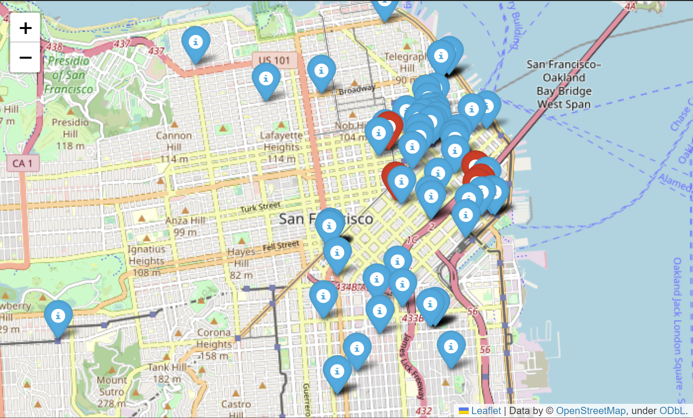

# GeoSpatial Data Project
## Project3 - Gamming Industry

This README provides an overview of a Python project aimed at helping a gaming industry company find an ideal location for their office. The project involves extracting, transforming, and visualizing data to make an informed decision.

## Context
**Company scheme:**
- 20 Designers
- 5 UI/UX Engineers
- 10 Frontend Developers
- 15 Data Engineers
- 5 Backend Developers
- 20 Account Managers
- 1 Maintenance guy that loves basketball
- 10 Executives
- 1 CEO/President.

**Preferences listed by the employees on where to place the new office:**
- Designers like to go to design talks and share knowledge. - There must be some nearby companies that also do design.
- 30% of the company staff have at least 1 child.
- Developers like to be near successful tech startups that - have raised at least 1 Million dollars.
- Executives like Starbucks A LOT. Ensure there's a starbucks not too far.
- Account managers need to travel a lot.
- Everyone in the company is between 25 and 40, give them some place to go party.
- The CEO is vegan.
- If you want to make the maintenance guy happy, a basketball stadium must be around 10 Km.
- The office dog—"Dobby" needs a hairdresser every month. Ensure there's one not too far away.

## Libraries Used
- **Pandas**: Used for data manipulation and analysis.
- **Matplotlib**: Utilized for creating static data visualizations.
- **Seaborn**: Employed for creating more aesthetically pleasing and informative visualizations.
- **Pymongo**: Connecting to MongoDB database.
- **Folium e Cartoframes**: Creating interactive maps.
- **Requests**: Making API calls to FourSquare
- **Geopandas**: Geospatial data analysis.
- **Getpass**: For securely storing authentication credentials.

## Extraction

In this stage was collected the external data from a Wikipedia page with the information about Human Development Index (HDI) of different nations.

In the extraction phase, a MongoDB database that contains data on companies worldwide was used. The data was filter to include only companies that have raised at least 1 million dollars and have fewer than 100 employees. Was also extract information about the company's city, category, and location (latitude and longitude).

## Transformation

**The transformation step involves several processes, including:**

1. Cleaning and formatting the extracted data.
2. Determining the most suitable city for the gaming industry based on the number of gaming companies in each city.
3. Identifying the top neighborhoods in the chosen city using Foursquare data. This includes finding the number of Starbucks, airports, pubs, vegan restaurants, kindergartens, dog hairdressers, gaming industry companies, and startups in each neighborhood.
4. Assigning weights to each neighborhood feature based on company preferences.
5. Normalizing the data to calculate a final score for each neighborhood.

## API Four Square
The Foursquare API is used to search for various venues in specific neighborhoods, providing data on the number of specific types of venues in each neighborhood. This information is used to assess the suitability of each neighborhood for the gaming industry company.

## Visualizations and Analysis
The project includes various data visualization components:

1. Mapping all filtered companies on a world map.

2. Mapping filtered companies in the chosen city - San Francisco.

3. A bar plot showing the final score for each neighborhood in San Francisco, helping to identify the most suitable neighborhood for the company.

## Conclusion
We embarked on a journey to find the ideal location for a new gaming industry office. To accomplish this, a structured approach that involved data extraction, analysis, and visualization was followed.

First the dataset was filtered to include only companies that had raised more than 1 million and employed fewer than 100 individuals. This filter was designed to ensure that the gaming industry company could be located near businesses of similar size and potential.

To determine the most suitable city for our venture, a table that detailed the number of companies in each city and identified the presence of gaming industry companies was created. The city that emerged as the top contender was San Francisco. However, it's important to exercise caution since San Francisco already hosts a considerable number of gaming companies, as highlighted by the red markers on the map that is shown above in the visualization area.

With the city decided, the attention turned to neighborhood selection. Was considered various criteria provided by stakeholders, including proximity to starbucks, airports, pubs, kindergartens, vegan restaurants, and dog hairdressers. Additionally, we factored in the number of gaming companies and startups in each neighborhood.

To weigh the importance of each criteria, was assigned scores ranging from 0 to 10, with higher scores indicating greater significance. These evaluations enabled us to measure the appropriateness of each neighborhood.

To provide a fair comparison, we normalized the scores to ensure consistency across the different criteria. The normalization process adjusted the scores, placing them on a scale of 0 to 10.

The final step revealed that the neighborhood "SoMa (South of Market)" obtained a perfect score of 10. Consequently, this analysis suggests that "SoMa (South of Market)" is the prime location for the new gaming industry office. It not only aligns with the company's preferences but also offers the potential for success in the thriving gaming industry landscape of San Francisco.

# Links 
[Apresentation](https://www.canva.com/design/DAFzYDGJpcY/Rz3CxuuJB_TfTueVCpOQEQ/edit?utm_content=DAFzYDGJpcY&utm_campaign=designshare&utm_medium=link2&utm_source=sharebutton)
